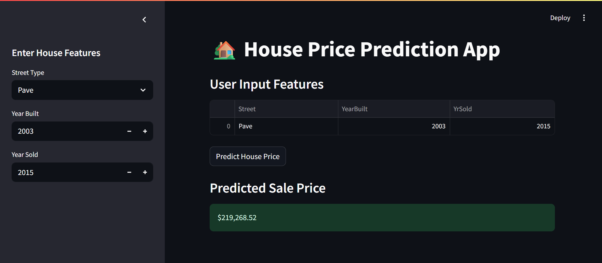

# 🏡 House Price Prediction App

This project predicts house prices using a Linear Regression model built with Scikit-learn and deployed using Streamlit.  
The app allows users to input house features (`Street`, `YearBuilt`, `YrSold`) and instantly get a predicted sale price.

## 📂 Project Structure
house-price-prediction/
│── app.py                        # Streamlit app
│── house\_price\_model\_simple.pkl  # Trained ML pipeline
│── requirements.txt              # Dependencies
│── README.md                     # Project documentation
│── notebooks/                    # Jupyter notebooks for training (optional)

## Screenshot

## 🚀 How to Run the App

1. **Clone the repository** 
   git clone https://github.com/your-username/House-Price-Prediction-using-linear-regression--streamlit.git
   cd house-price-prediction-streamlit
2. **Install dependencies**
   pip install -r requirements.txt
3. **Run the Streamlit app**
   streamlit run app.py
4. **Interact with the app**
   * Enter values for `Street`, `YearBuilt`, and `YrSold` in the sidebar.
   * Click **Predict House Price** to view the estimated sale price.

## 📊 Dataset

The model is trained on the [Kaggle House Prices Dataset](https://www.kaggle.com/c/house-prices-advanced-regression-techniques/data).

## ⚙️ Tech Stack

* **Python** (Pandas, NumPy, Scikit-learn, Joblib)
* **Machine Learning** (Linear Regression with Pipelines)
* **Streamlit** (for interactive deployment)

## ✨ Features

* End-to-end ML workflow (data preprocessing → training → saving model → deployment)
* Uses `ColumnTransformer` with **OneHotEncoder**, **StandardScaler**, and **SimpleImputer**
* Saves trained pipeline with **Joblib**
* Deployable Streamlit app with a clean UI
